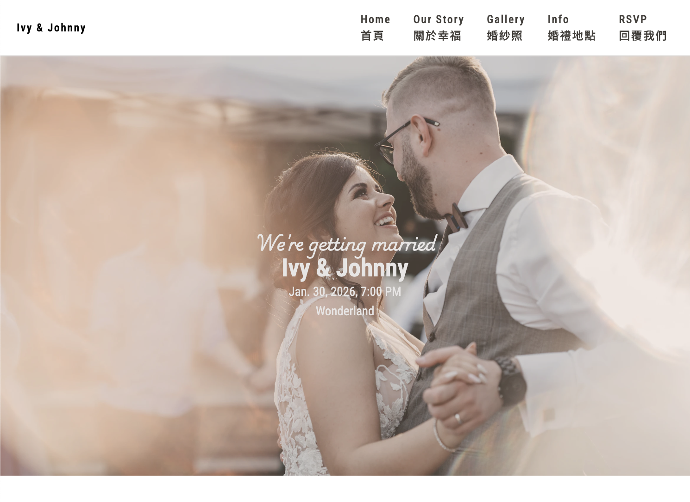
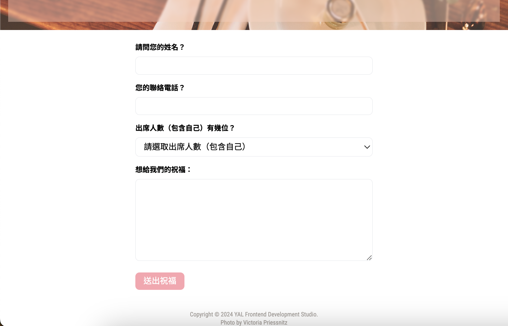

# React + Vite + Tailwind

## wedding card

一個婚禮邀請函，可以另外串接 form 服務來取得表單資料。

- Screenshot:
  
  

## Built with

- React
- Vite

## Runs the app

```Shell
npm run dev
```

- Runs the app in the development mode.
- Open [http://localhost:5173](http://localhost:5173) to view it in your browser.

- The page will reload when you make changes.
- You may also see any lint errors in the console.

## Links

- Live Site URL: [live site URL here](https://yalstudio-wedding-invitation.netlify.app/)

## Author

- My GitHub - [YACodingroom](https://github.com/YAcodingroom)

## Acknowledgments

- Ivy & Ciao
- YAL me
- Dr.Angela & Jonas
- Unsplash & Victoria
